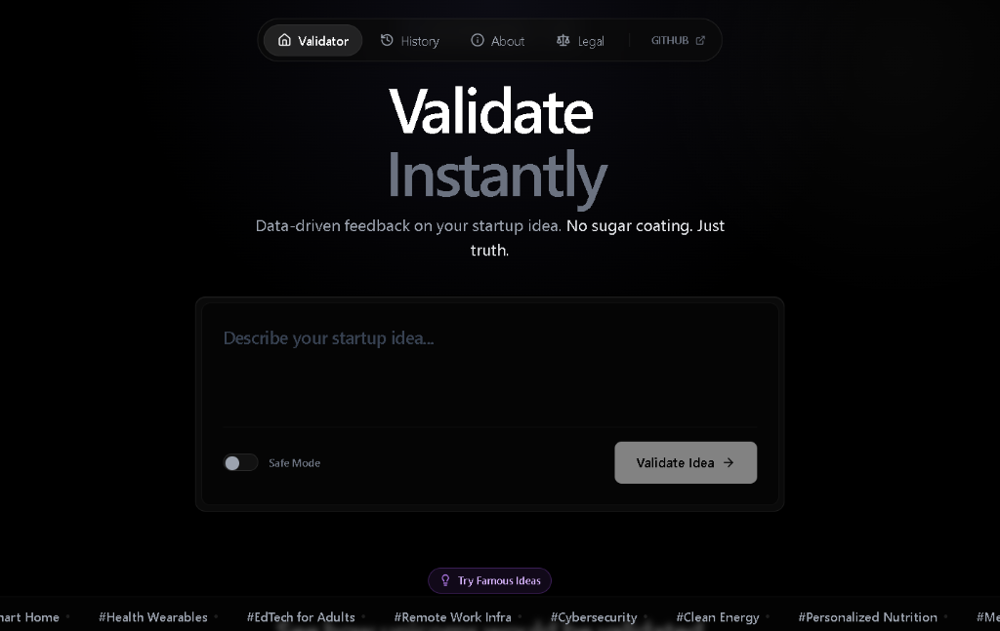
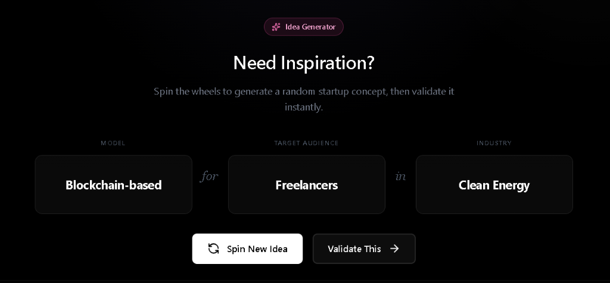
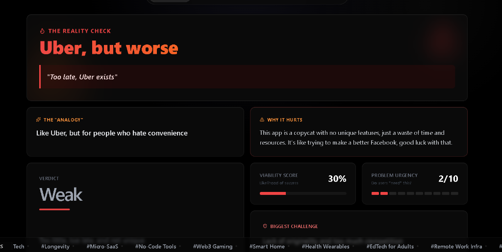
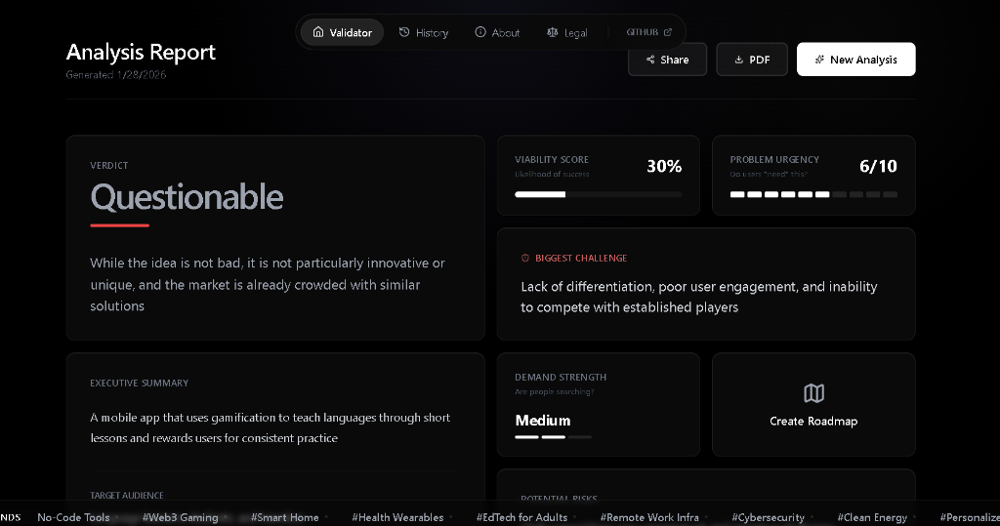
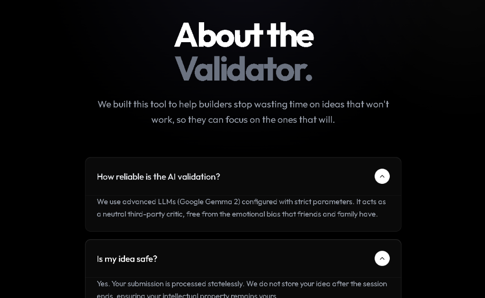

<div align="center">
 

  <h1 style="font-size: 3rem; font-weight: bold; margin-top: 20px;">AI Idea Validator</h1>
  
  <p>
    <a href="https://nextjs.org">
      
    </a>
    <a href="https://tailwindcss.com">
      
    </a>
    <a href="https://ai.google.dev/">
      
    </a>
    <a href="https://vercel.com">
      
    </a>
  </p>

  <p style="font-size: 1.2rem; color: #888;">
    <b>Stop building in the dark. Validate your startup ideas instantly with brutal AI honesty.</b>
  </p>
</div>

---

## 🚀 Overview

**AI Idea Validator** is a decision-support tool designed for founders, hackers, and dreamers. It analyzes your startup idea using advanced LLMs to provide structured, realistic feedback on viability, risks, and next steps. 

> "Many founders waste weeks or months building products without validating whether the idea solves a real problem or has market demand."

## ✨ Key Features

- **💡 Deep Analysis**: Target users, problem severity, and market demand assessment.
- **🛡️ Honest Feedback**: No fluff. Just brutal, data-driven truths about your idea.
- **🏗️ MVP Guidance**: Clear steps on what to build first.
- **⚖️ Final Verdict**: A probability-based assessment: **Build, Pivot, or Drop**.
- **🔥 Roast Mode**: Switch to "Safe Mode" off for a savage, roasting breakdown of why your idea might fail.
- **🎨 Glassmorphism UI**: A stunning, modern interface inspired by macOS aesthetics.

## 📸 Screenshots

<div align="center">
  
  <p><i>The clean, minimalist input interface waiting for your next big idea.</i></p>
</div>

<div align="center">
  
  <p><i>Need inspiration? Spin the wheel to generate unique startup concepts.</i></p>
</div>

<div align="center">
  
  <p><i>🔥 Roast Mode: Brutally honest, sarcastic feedback for those who can handle the heat.</i></p>
</div>

<div align="center">
  
  <p><i>Comprehensive results: Verdict, Confidence Score, and Challenge Assessment.</i></p>
</div>

<div align="center">
  
  <p><i>Transparent background and methodology.</i></p>
</div>

## 🛠️ Tech Stack

- **Framework**: Next.js 15 (App Router)
- **Styling**: Tailwind CSS + Custom Glassmorphism Utilities
- **AI Model**: Google Gemini 2.0 Flash
- **State Management**: React Hooks

## 🚀 Getting Started

1. **Clone the repository**:
   ```bash
   git clone https://github.com/ameen-ansarii/AI-Idea-Validator.git
   cd AI-Idea-Validator
   ```

2. **Install dependencies**:
   ```bash
   npm install
   ```

3. **Set up Environment Variables**:
   Create a `.env.local` file and add your Gemini API key:
   ```bash
   NEXT_PUBLIC_GEMINI_API_KEY=your_api_key_here
   ```

4. **Run the development server**:
   ```bash
   npm run dev
   ```

## 📄 License

This project is open-source and available under the [MIT License](LICENSE).

---

<div align="center">
  Developed with ❤️ by <a href="https://github.com/ameen-ansarii">Ameen Ansari</a>
</div>
